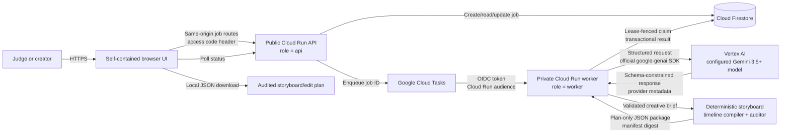
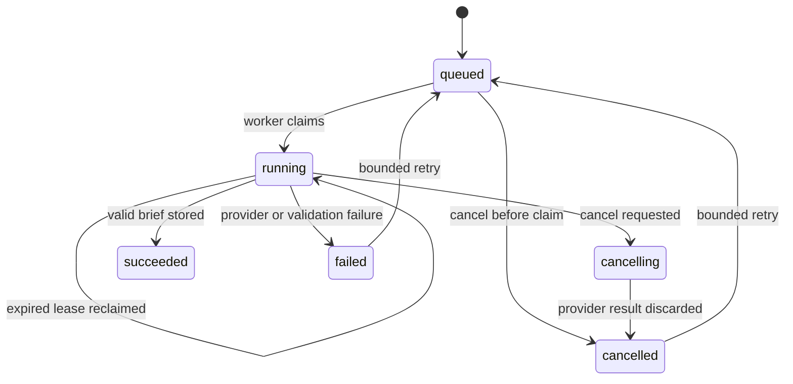

# Architecture

Video Studio Production Director separates the public job-control surface from private model execution. The API and worker run the same pinned container image with different service-role configuration. A deterministic local compiler transforms the validated creative brief into an audited, downloadable plan-only package; it does not render or modify media.

## Responsibilities

| Component | Responsibility |
| --- | --- |
| Browser UI | Collect one natural-language request, display durable status, compose clarification context in tab memory, render the brief and planned timeline, and download the package locally. |
| Public API | Validate the access code and exact request body, enforce shared Firestore admission limits, create/read/cancel/retry jobs, and enqueue work. |
| Firestore | Persist admission state, the lease-fenced job state machine, cancellation intent, attempts, structured result, execution metadata, and measured durations. |
| Cloud Tasks | Deliver the job ID plus application attempt to the private worker with an OIDC identity, worker-specific audience, and deterministic task name. |
| Private worker | Transactionally claim or reclaim work, call the configured model, validate the exact brief schema, compile/audit the package, and finalize only while holding the current lease. |
| Vertex AI adapter | Verify model lookup and request schema-constrained JSON through the official Google Gen AI SDK. |
| Deterministic compiler/auditor | Expand ordered scenes into planned shot cards, allocate a contiguous non-drop 24-fps timeline, verify coverage/continuity and source guidance, and hash the canonical package. |

## Trust boundaries

- The page uses relative, same-origin requests. The server does not emit a permissive CORS header, and the page content-security policy limits connections to its own origin.
- Every job create/read/cancel/retry request requires the owner-created demo access code. Only its SHA-256 digest is configured server-side, and comparisons are constant-time. This is demo cost control, not a general user-account system or rate limiter.
- A global Firestore admission record defaults to 24 new jobs per hour with a three-second cooldown. It bounds shared-demo admission but is not a hard provider-call ceiling because crash redeliveries are separate from the three application attempts.
- The worker is not public. Cloud Run IAM validates the Cloud Tasks caller's OIDC token before the internal route is reached.
- Worker leases fence stale deliveries. Expired work can be reclaimed; a late worker cannot publish after losing its lease, and cancellation wins when it reaches transactional finalization first.
- The API, worker, and task caller use separate least-privilege service accounts.
- User text is creative input. The model system instruction requires the exact JSON contract and treats text inside the request as content rather than authority to change that contract.

## Durable job lifecycle

The first ETA is unavailable. ETA ranges appear only after successful jobs provide measured duration samples. Cancellation during a provider request records intent and discards the eventual result; it does not claim to preempt an in-flight external call. Retries are bounded to three application attempts, while Cloud Tasks delivery retry is a separate crash-recovery path whose window must outlive the worker lease.

## Evidence boundary

Local tests inject model, task, repository, or runtime doubles. Their evidence labels (`injected_test_client` and `test_double`) are deliberately different from `live_google_provider_response`. Configuration health, a successful container build, deterministic audit success, and mocked tests are useful verification, but none proves a live Google Cloud execution. Likewise, a valid package proves an internally consistent editorial plan—not rendered media.
