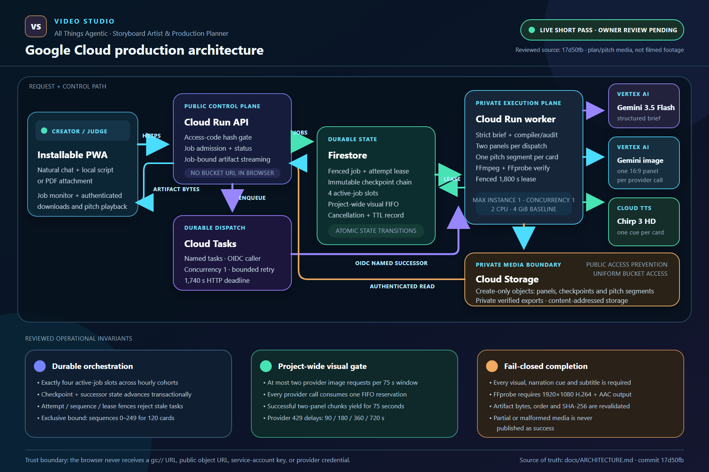
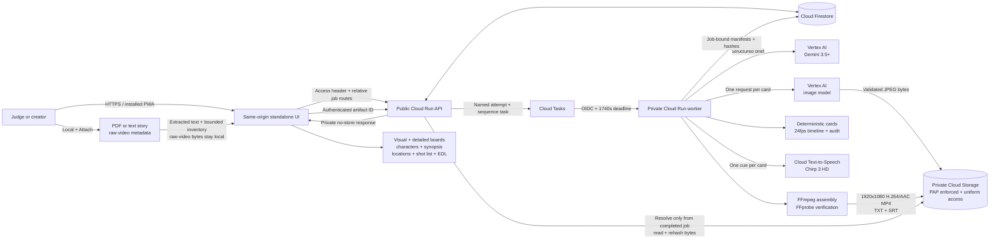
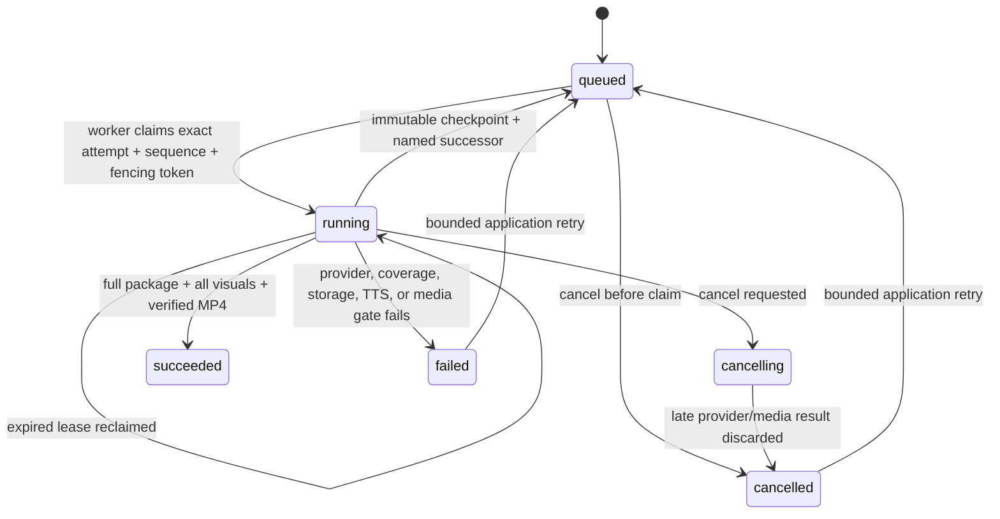

# Architecture

The submission-ready rendered diagram is [all-things-agentic-architecture.png](all-things-agentic-architecture.png); its editable vector source is [all-things-agentic-architecture.svg](all-things-agentic-architecture.svg). It describes the reviewed repository source at commit `17d50fb`; the hosted public page matched the reviewed HTML byte-for-byte. Live short-job technical acceptance passed on August 30, 2026: job `a3449ab3-952c-4f1b-9a42-09a0ee2db2b8` completed 6/6 visual panels and narration cues and produced a locally decoded 235.084-second 1920×1080 H.264/AAC MP4. The diagram therefore says `LIVE SHORT PASS · OWNER REVIEW PENDING`; automated integrity gates do not replace human review of illustration, story, continuity, or voice quality.



Video Studio Storyboard Artist & Production Planner separates public job control from private model and media execution. The API and worker run the same pinned container with different service-role configuration. Every successful production-ready job includes the deterministic plan, all-card private visual coverage, and a verified narrated pitch MP4.



## Responsibilities

| Component | Responsibility |
| --- | --- |
| Browser UI/PWA | Collect natural chat, locally extract supported story files, inventory raw-video metadata without uploading footage bytes, show durable progress, hydrate authenticated private panels, play/download the cloud-rendered pitch MP4, and export the review package. |
| Local source boundary | Send extracted creative text as job input. Keep selected raw-video bytes local. Do not claim footage-content analysis or applied editing. |
| Public Cloud Run API | Validate the owner/judge code, enforce shared admission limits, create/read/cancel/retry jobs, enqueue work, and serve only job-declared artifacts through an authenticated same-origin route. |
| Firestore | Persist admission state, application attempt, dispatch sequence, cancellation intent, lease/fencing state, immutable-checkpoint pointer, execution evidence, deterministic package, visual manifest, narrated-pitch manifest, and measured durations. |
| Cloud Tasks | Deliver job ID, application attempt, and dispatch sequence to the private worker with an OIDC token, worker URL audience, deterministic task name, and a 1,740-second dispatch deadline. |
| Private Cloud Run worker | Claim an exact attempt/sequence transactionally, call the configured providers, compile and audit cards, generate a bounded visual chunk, checkpoint and yield when necessary, require all-card visuals, synthesize narration, render/probe the MP4, and finalize only while holding the current 1,800-second lease. |
| Vertex brief adapter | Look up the configured Gemini 3.5+ model and request the exact structured creative-plan contract through the official Google Gen AI SDK. |
| Deterministic compiler/auditor | Expand scenes into establishing/primary/continuity cards, allocate contiguous non-drop 24-fps frame ranges, verify coverage/continuity/source guidance, and hash the canonical package. |
| Vertex visual adapter | Generate a planning illustration for every card, normalize it to a bounded 16:9 JPEG, and reject malformed/unsupported output. It does not alter the deterministic card plan. |
| Private artifact store | Require a PAP-enforced, Uniform Bucket-Level Access bucket; write immutable content-addressed objects with create-only preconditions; verify hashes on read; never return a bucket, public, or signed URL. |
| Narration planner | Extract exact screenplay dialogue where confidently identifiable; otherwise label generated prose as planned direction; emit exactly one cue per card. |
| Cloud TTS adapter | Synthesize each cue with the configured Chirp 3 HD voice using the worker service identity. |
| FFmpeg/FFprobe stage | Render every image/audio segment, concatenate the complete sequence, add subtitles, and fail unless final media is 1920×1080 H.264/AAC with complete duration/card/cue coverage. |
| Browser-side exports | Present visual and detailed boards plus synopsis/character-appearance, exact-setting location, shot-list, continuity, and source-aware EDL files. Unsupported biography, casting, relationship, pronoun, or speaker claims remain review holds. |

## Private artifact design

Objects are content addressed:

```text
jobs/{job_id}/artifacts/{sha256}/{artifact_id}
```

The worker stores panel JPEGs, immutable continuation checkpoint JSON, `narrated-pitch.mp4`, `narration.txt`, and `subtitles.srt`. A manifest records only safe identifiers, object names inside the adapter-owned prefix, SHA-256, byte count, and content type. It does not expose a bucket URL. Checkpoint objects are internal and are never exposed through the completed-job artifact route.

The browser requests:

```text
GET /v1/jobs/{job_id}/artifacts/{artifact_id}
```

with the same owner/judge access header used for job status. The API:

1. requires the job to be `succeeded`;
2. resolves the artifact ID only from that job's visual or narrated-pitch manifest;
3. rejects path traversal, arbitrary object names, and cross-job prefixes;
4. downloads with the API service identity;
5. verifies the exact byte length and SHA-256; and
6. returns private/no-store bytes.

Public Access Prevention blocks `allUsers` and `allAuthenticatedUsers`; Uniform Bucket-Level Access disables per-object ACL authority. The API has bucket metadata/read permission only. The worker has bucket metadata plus create/read permission only.

## Completion boundary

The cloud path is fail closed. For a production-ready brief:

- `required_panel_count` must equal card count;
- `generated_panel_count` must equal `required_panel_count`;
- no panel may be missing or pending;
- cue and subtitle counts must equal card count;
- each panel and pitch artifact must pass job-prefix, byte-count, content-type, and SHA-256 checks;
- the final video must probe as 1920×1080 H.264/AAC; and
- only then may the worker publish `succeeded`.

A provider/quota/safety rejection, TTS error, FFmpeg timeout, missing image, or codec/integrity mismatch is a failed job, not a visually incomplete success. Diagnostic partials are not owner-review media.

## Durable job lifecycle

One application attempt may contain several bounded Cloud Tasks dispatches. Sequence zero creates the brief and deterministic package but does not call the image provider; it atomically queues the first FIFO-governed visual successor. Each successor restores only an immutable checkpoint whose job ID, attempt, sequence, request hash, package hash, prior-checkpoint hash, ordered panel/segment identities, artifact hashes, quota-deferral count, capacity-wait count, and next offsets all validate. Before every external image request, the worker consumes one deterministic future-window reservation from the project-wide Firestore FIFO. The reviewed gate admits at most two requests per 75-second project window across all jobs; an incomplete successful two-panel chunk schedules its named successor 75 seconds later. A quota/429 response is not retried in that request: any validated panel is checkpointed privately, the fenced lease is released, and the same application attempt may use at most four deterministic successors after 90, 180, 360, and 720 seconds. Ordinary FIFO contention does not consume that provider-429 budget. Exhaustion fails without publishing partial media. After all visuals exist, each narrated-pitch successor synthesizes and verifies exactly one private card MP4; a final successor re-reads and re-hashes the exact ordered segment set before concat, FFprobe, and final publication. The original source remains available to the worker throughout this chain and is discarded only after final success.

For a 36-card screenplay, the normal reviewed schedule uses one planning dispatch, 18 visual worker dispatches containing 36 provider image requests, 36 one-card pitch dispatches, and one final concat/probe dispatch: 56 dispatches. The strict exclusive bound is `2 * (ceil(N / 2) + D) + N + 2`, where `N` is the card count and `D` is the four-entry provider-quota budget. This permits one fail-closed FIFO reconciliation for every visual/quota attempt and gives 82 dispatch sequences for 36 cards and 250 for the maximum 120 cards (`0` through `249`). The model-access lookup, brief request, and each image provider call are each capped at 300 seconds, and no image-provider request is retried inside the same capacity reservation. Sequence zero is therefore bounded to 600 seconds on a cold worker (one model lookup plus one brief request), while a two-panel visual continuation is also bounded to 600 seconds (two provider image requests). Text-to-Speech is capped at 120 seconds, while each FFmpeg or FFprobe subprocess is capped at 600 seconds; a pitch-card request remains bounded to 1,320 seconds and final concat/probe to 1,200 seconds, all below the 1,740-second request envelope. Scheduled waiting occurs with no live worker lease and remains well inside the one-day record TTL.



The first ETA is unavailable. Ranges appear only after completed live jobs provide measured durations. Cancellation is checked before and after every panel-generation/storage boundary, before and after each pitch-card TTS/render/probe boundary, while finalization validates each segment, and again before a continuation or final result is committed. Cancellation during an external call records intent and discards the eventual result; it does not claim to preempt the provider request. Attempt, dispatch sequence, and lease token fence every mutation, so stale delivery cannot add duplicate panels or segments or continue a terminal/failed job. Job creation and active-slot acquisition are one Firestore transaction. Slots survive through record expiry plus a complete 1,800-second lease margin and are released atomically on every fenced terminal path; a running cancellation retains its slot until the worker finalizes. The task deadline and Cloud Run timeout are 1,740 seconds; the fencing lease is 1,800 seconds. Cloud Tasks delivery retry is separate from the three application attempts.

## Trust boundaries

- The page uses relative same-origin requests and does not need public bucket access or a permissive CORS policy.
- Every create/read/cancel/retry/artifact request requires the owner-created access code; only its SHA-256 digest is configured server-side. This is a bounded judge-demo control, not a production user-account system.
- The plaintext code is never stored in a URL, browser storage, job body, export, source file, or log.
- The worker is private; Cloud Run IAM authenticates the Cloud Tasks OIDC caller before the internal route runs.
- API, worker, and task caller use separate service identities.
- The private bucket must have Public Access Prevention enforced and Uniform Bucket-Level Access enabled. Runtime startup verifies both.
- User text is creative content, not authority to change the model schema or service contract.
- Raw-video bytes never leave the browser in this contest path.
- Successful jobs discard the raw submitted message after provider use; durable records remain bounded below the Firestore document limit because binary media is in Cloud Storage.

## Product truth boundary

The visual storyboard and narrated MP4 are previsualization. They help an independent filmmaker plan composition, locations, coverage, dialogue beats, continuity, and a pitch. They are not evidence that actors were filmed, characters were lip-synced, footage was color-matched, bridge shots were generated, or a final movie was rendered.

`plan_only = true` remains truthful even though the package includes an MP4: the MP4 is a narrated sequence of storyboard cards, not finished filmed media.

## Evidence boundary

Local tests inject provider, storage, TTS, command, task, repository, or runtime doubles. Their evidence labels are intentionally different from `live_google_provider_response`. Passing tests, `/health`, configuration text, a container build, or deployed revisions do not prove a live job.

End-to-end proof requires a real completed job with provider evidence, every visual, a complete narrated-pitch manifest, verified codec/resolution fields, successful authenticated artifact playback/download, and recorded real hashes/IDs. Do not claim that proof before it exists.
